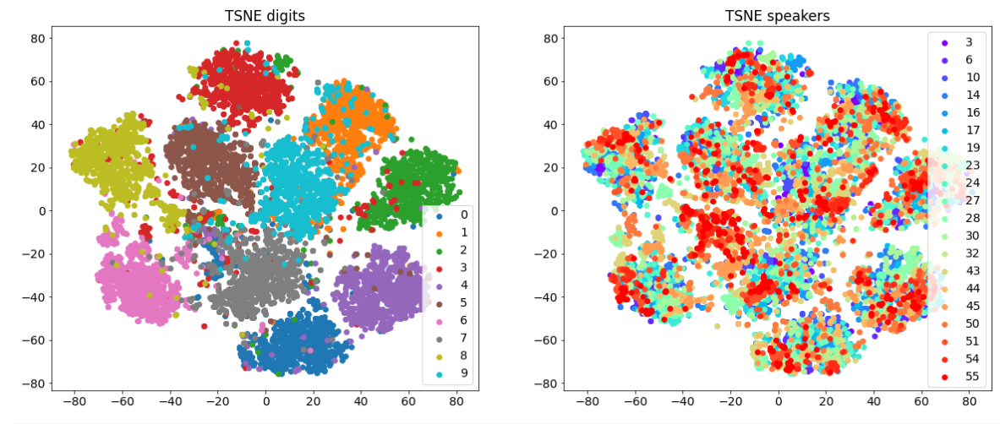

# Self-supervised methods in audio

## Introduction
In this subproject we pretrain audio encoders using approach 
described in paper 
[Multi-format contrastive learning](https://arxiv.org/abs/2103.06508). 
We conduct experiments using 
[AudioMNIST](https://github.com/soerenab/AudioMNIST) dataset.

We pretrain two types of models:

1) The first type is just 1D encoder, that works directly with wav 
representation of recordings. As 1D encoder we use model of Res1dNet
architecture, described in paper 
[PANNs: Large-Scale Pretrained Audio Neural Networks for Audio Pattern Recognition](https://arxiv.org/abs/1912.10211#content).
2) The second type is 2D encoder which works with MEL-spectrogram 
representation of recordings. As 2D encoder we use ResNet18. Thus, 
both our encoders have approximately equal number of parameters.

Both encoders use adaptive pooling in the end of their pipelines and
produce embeddings of size 512. By training encoders supervisely we 
obtain 98.4% accuracy for 1D encoder and 99.2% for 2D encoder.

## Self-supervised pretraining
We shortly describe the [MFCL](https://arxiv.org/abs/2103.06508) approach:
firstly, recording is cropped into two shorter clips, and one of them is
transformed into spectral representation. Then, augmentations are applied. 
Finally, the model learns by maximizing the similarity between the encoded clips
of the same audio by utilizing Contrastive loss.

It is clear from our description, that this approach pretrains 1D and
2D encoders simultaneously. For pretraining we use 4 different settings:

1) Pretrain encoders without augmentations.
2) Use augmentations for only one encoder.
3) Use augmentations for both encoders.

Authors of the [MFCL](https://arxiv.org/abs/2103.06508)
approach crop recording into two clips each
lasting 3 seconds. However, our recordings last at most one second. 
So by conducting several experiments we find the best (relative) 
clip length of 45% of recording length.

We fix sets of augmentations for both encoders and perform pretraining.
We compare different model by accuracy of linear probing on the 
validation split. One may find more information about pretraining in the
[notebook](./main.ibynb).

As a result, the best accuracy on the validation split was shown by
2D encoder, that was pretrained with augmentations. Its accuracy is 92.7%.

## Visualisation
Here we provide some visualisation of the TSNE embeddings of the 
recordings passed through audio encoders. We plot embeddings from 2D 
encoders, trained supervisely and self supervisely for comparison.

On this picture we plot TSNE embeddings from 2D encoder trained supervisely
on digit classification task. On the left plot, embeddings of recordings 
where the same digit is pronounced are marked with the same color,
while on the right one, the same speaker is represented. As we can see,
we obtained almost perfect clusters for digits classification task, while
there is no obvious structure for speaker classification task (which is OK,
as model wasn't trained on this task).

Here we plotted embeddings from 2D encoder trained self-supervisely using
[MFCL](https://arxiv.org/abs/2103.06508) approach. Here we also can see
relatively fine clusters for digit classification task (which is unexpected,
as model was not trained for this task), but still no obvious structure
for speakers classification task.

## Voice identification

We also trained KNN classifier on the embedding obtained by our encoder on
speaker classification task. We found number of neighbours by cross validation.
We also used a pair of 1D encoders for this task: the encoder, trained
supervisely on digit classification task and the encoder, trained self-supervisely
without augmentations. The reason why we didn't use 2D encoder from
the previous part is that TSNE embeddings of speakers
from 1D encoder (may be found [here](./main.ibynb)) appeared to be more
visually appealing. The results are following:

| Model                      | Accuracy |
|----------------------------|----------|
| Supervised 1D encoder      | 86.2%    |
| Self-supervised 1D encoder | 82.5%    |
